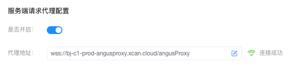

# 代理配置

> 通过3步完成服务端代理配置：`部署代理程序 → 配置代理地址 → 验证连接状态`，确保跨域请求顺利发送。

## 一、基础准备

**安装代理程序**  
- 按 [安装AngusProxy](../../installation/AngusProxy) 指南部署请求代理 
- ⚠️ 需开放 `6806` (HTTP) 或 `443` (HTTPS) 端口  

## 二、代理配置
> `服务端代理`适用内网测试场景，`云代理`仅支持公网服务

### 1. 服务端代理配置（推荐）
1. `AngusTester` → `配置` → 「代理」
2. **启用代理**：  
   ☑️ 勾选服务端请求代理配置 `启用` 开关
3. **连接设置**：  
   地址格式： `ws://[服务器IP]:6806/angusProxy` (或 `wss://[域名]:443/angusProxy`)  
   💡 示例： `ws://192.168.1.100:6806/angusProxy`
4. **自动验证**：  
   焦点移出输入框时自动检测，显示 ✅ 即为成功

::: tip 说明
- 该方式需要将`代理程序`单独安装在共享网络的服务器主机。
- 使用服务端代理无需用户在各自电脑中安装代理程序，配置后将使用服务端代理发送请求。
:::

### 2. 云代理配置
1. `AngusTester` → `配置` → 「代理」
2. **启用代理**：  
   ☑️ 勾选服务端请求代理配置 `启用` 开关
3. 粘贴默认云代理地址：
   ```text
   wss://bj-c1-prod-angusproxy.xcan.cloud/angusProxy
   ```


::: warning 重要提醒
⚠️ 云代理无法访问内网服务
:::

## 三、生效验证
1. **界面验证**：  
   成功连接后显示状态标识：
   - ✅ 绿色徽标：代理可用
   - ❌ 红色叉号：断开、未连接成功

2. **查看日志**：  
   - **浏览浏览器控制**：查看连接失败原因，如网络不通
   - **查看代理服务日志**：控制台查看 `AngusProxy/logs/proxy.log` 错误日志
