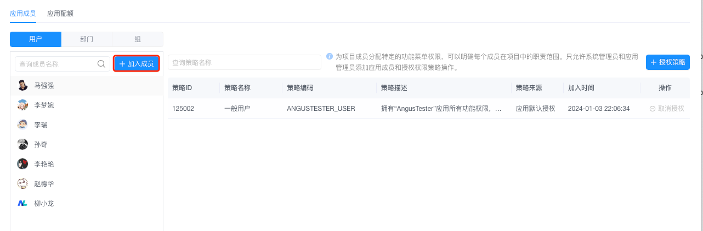
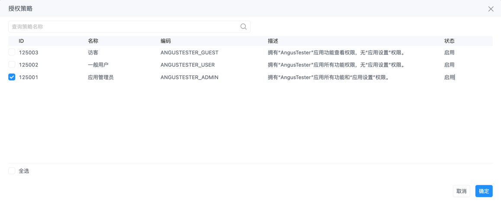
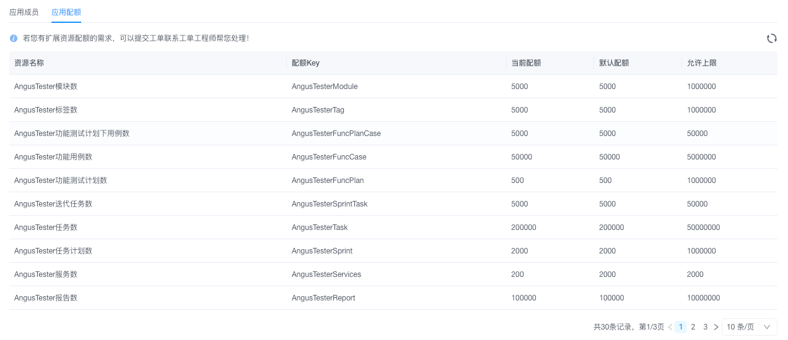

# 应用配置

> 应用配置允许用户自定义界面标题、Logo、域名，授权用户应用功能菜单权限，查看应用授权配额信息。

## 一、基础准备
1. **权限确认**  
   ☑️ 当前账号需具备 `系统管理员` 或 `应用管理员` 角色  
   ⚠️ 部门/组权限继承：授权部门/组 → 自动覆盖关联成员

2. **数据中心版特别要求**  
   `服务器环境` → 准备新Logo文件（推荐尺寸：`160×40px`，格式：`PNG`）

## 二、核心操作

### 1. 应用信息定制
> *仅数据中心版本支持*

1. 导航至 `配置` → `应用`
2. **基本设置**：  
   ① 点击「应用标题」输入框 → 输入新名称（限20字符）  
   ② 点击「Logo」上传区 → 选择新标识文件  
3. **域名修改**（可选）：
   - 输入 `https://` 开头的完整域名
   - 系统自动校验格式有效性

### 2. 权限策略管理
1. 导航至 `配置` → `应用`，切换至 `应用成员` Tab页
2. **成员新增**：  
   ① 点击「加入成员」→ 选择目标用户/部门/组
   
   ② 权限策略：勾选对应功能授权策略
   
   ③ 点击「确定」完成授权
3. **策略调整**：  
   ① 选中左侧已有成员 → 点击顶部「授权策略」  
   ② 调整复选框 → 点击「确定」保存后生效
4. **取消授权**：  
   ① 选中已有成员 → 点击右侧授权策略「取消授权」  
   ② 点击后立即生效，并且授权策略被移除

### 3：配额状态监控
**操作说明**：在应用配置页面查看AngusTester的当前资源配额及使用情况

**操作步骤：**
1. 进入 `AngusTester配置 → 应用` 页面
2. 在应用配置Tab页查看资源配额信息  

⚠️ **配额说明**：
- 用户数/并发数/节点数/并发任务数需购买对应配额
- 其他配额可直接修改（云服务版需提交工单）