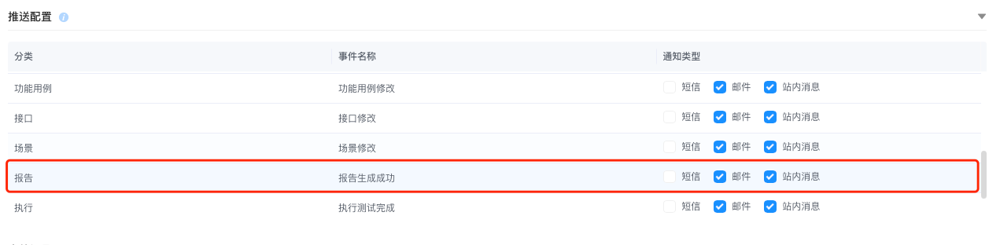
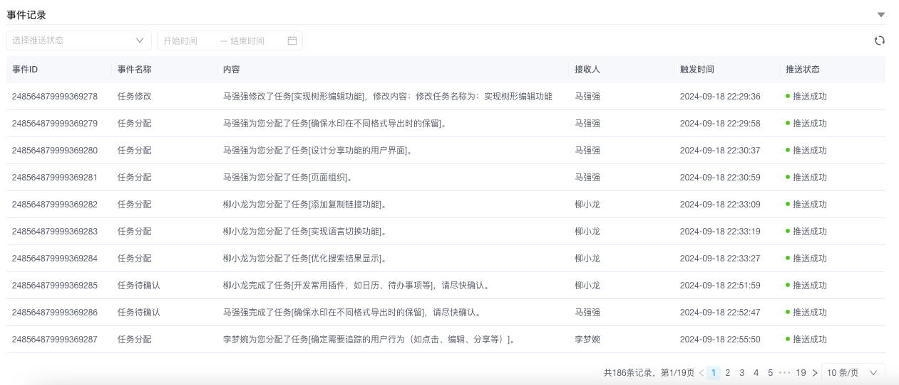

# 事件配置

> **AngusTester 事件配置** 提供实时的信息更新与状态反馈，助力团队快速识别并响应潜在问题。通过灵活的通知机制，确保团队在复杂测试环境中高效协作，保障软件质量与交付时效。

## 功能介绍

- **实时通知推送：** 即时推送测试任务开始、完成或失败等关键状态变化，确保团队成员第一时间掌握项目动态。
- **事件分类管理：** 通知按类型（如任务状态变更、系统警告、资源异常）分类，支持按需订阅，有效过滤信息噪音。
- **个性化通知设置：** 用户可自定义通知接收方式（邮件、短信、应用内消息），确保重要信息直达。
  - 短信配置路径：`AngusGM > 短信配置`。
  - 邮箱服务器配置路径：`AngusGM > 邮箱服务器配置`。
- **完整事件历史：** 自动记录所有通知事件，便于问题回溯与测试进展分析。
- **协作工具集成：** 无缝对接企业微信、钉钉、Webhook等协作平台，接收和处理通知，提升协作效率。

## 支持的业务事件

AngusTester 自动触发以下关键业务事件的通知：

- **任务即将逾期：** 任务临近截止日期时提醒处理。
- **任务已逾期：** 任务超期未完成时发出警告。
- **任务分配：** 通知相关人员其新分配的任务。
- **任务待确认：** 分配任务后，提醒接收者确认。
- **任务修改：** 任务内容或参数变更时通知相关人员。
- **功能用例即将逾期：** 功能用例临近截止日期时提醒处理。
- **功能用例已逾期：** 功能用例超期未完成时发出警告。
- **功能用例分配：** 通知相关人员其新分配的功能用例。
- **功能用例修改：** 功能用例变更时通知相关人员。
- **接口修改：** 系统接口相关变更时提醒开发和测试团队。
- **场景修改：** 测试场景变更时确保相关人员信息同步。
- **报告生成成功：** 测试报告成功生成时通知查阅。
- **执行测试完成：** 测试执行完毕时通知结果可分析。
- **执行测试失败：** 测试执行失败时告警，便于快速排查。

## 事件操作

### 配置事件接收方式
**操作说明：** 设置特定事件触发后的通知方式（邮件/短信/站内消息）。  
**操作步骤：**
1. 进入 AngusTester **“配置” > “事件”**。
2. 在 **“推送配置”** 区域：
   - 定位目标事件。
   - 选所需通知方式（邮件、短信、站内消息）。
3. 选择后配置自动保存生效
    

### 查看事件记录
**操作说明：** 查询所有测试相关事件的完整历史记录，保障项目透明与可追溯。  
**操作步骤：**
1. 进入 AngusTester **“配置” > “事件”**。
2. 在 **“事件记录”** 区域查看所有事件历史。
    