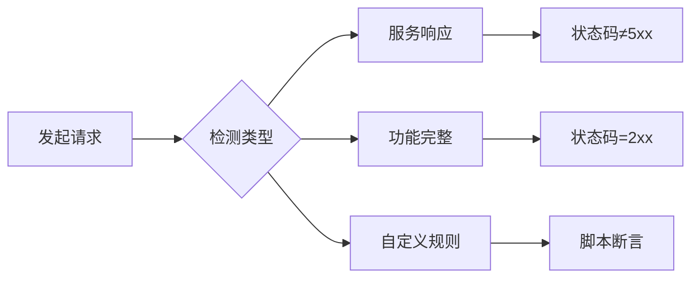
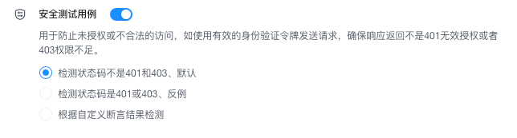
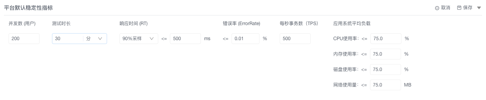

# 指标配置

> 通过统一配置功能/性能/稳定性三大类测试指标的`全局标准`，实现90%测试场景标准化评估，同时支持接口级灵活覆盖。配置完成后自动应用至所有新建测试任务，大幅提升测试效率。

::: tip ⚠️ **关键提示**：
1. 当期指标配置为默认全局设置，对所有项目都生效。
2. 接口级配置优先全局设置，配置路径：`接口 → 目标接口 → 指标配置`
:::

## 一、功能测试指标配置
> *定义冒烟测试与安全测试的基础通过标准*

### 1. 冒烟测试配置
**作用**：验证接口基础可用性

**操作步骤**：
1. `配置中心 → 指标管理 → 功能指标` 点击「编辑」
2. 开启`冒烟测试用例`开关
3. 选择检测策略（默认勾选"接口可用性"）：
    - ☑️ 服务响应性：返回非5xx状态码
    - ☑️ 接口可用性：返回2xx状态码（推荐）
    - ☑️ 自定义规则：按脚本逻辑判定  
      

### 2. 安全测试配置
**作用**：防止未授权访问  
**操作步骤**：
1. 相同页面 → 开启`安全测试用例`开关
2. 选择验证逻辑：
    - ✅ 正向验证：排除401/403状态（默认）
    - ✅ 反向验证：需返回401/403
    - ✅ 自定义策略：脚本判断授权逻辑  
      
3. 点击底部「保存」按钮

## 二、性能测试指标配置
> *设定压力测试的核心阈值标准*

### 1. 核心参数矩阵
| 指标 | 默认值 | 业务影响 | 优化建议 |
|---|---|---|---|
| **并发用户数** | 500 | 系统承载上限 | 根据生产流量120%设定 |
| **90%响应延迟** | ≤500ms | 用户体验 | 互联网类建议≤200ms |
| **错误率** | ≤0.01% | 业务可靠性 | 支付类系统设为0% |
| **增压步长** | 50用户 | 测试精度 | 每步增加10%并发 |

### 2. 配置步骤
1. `指标 → 性能指标` 点击「编辑」  
   
2. 修改关键参数
3. 点击「保存」

⚠️ **金融系统特别提示**：
- 错误率必须设为0%
- 通过全局配置或接口级覆盖实现
- 增压步长建议设为10（精度优先）

## 三、稳定性测试指标配置
> *验证系统长时运行的可靠性标准*

### 1. 核心参数矩阵
| 指标          | 默认值    | 业务影响  | 优化建议         |
|-------------|--------|-------|--------------|
| **并发用户数**   | 200    | 稳定压力  | 根据生产流量70%设定  |
| **测试时长**    | 30m    | 稳定区间  | 推荐24小时最佳     |
| **90%响应延迟** | ≤500ms | 用户体验  | 互联网类建议≤200ms |
| **错误率**     | ≤0.01% | 业务可靠性 | 支付类系统设为0%    |

### 2. 配置步骤
1. `指标管理 → 稳定性指标` 点击「编辑」  
   
2. **业务层配置**：
    - 并发用户数：200
    - 持续时长：30分钟
    - 错误率：≤0.01%
3. **资源层配置（可选）**：  
   | 资源类型 | 阈值 | 说明 |
   |---|---|---|
   | CPU | ≤75% | 超阈值时告警 |
   | 内存 | ≤75% | JVM应用重点关注 |
   | 磁盘 | ≤75% | 日志类系统关键指标 |
   | 网络 | ≤75MB/s | 视频类系统核心指标 |
4. 点击「保存」

⚠️ **资源监控前提**：  
需提前完成 `配置 → 节点` 配置

## 四、效能指标分级体系
> *量化团队工作效率的评分标准*

### 1. 五维评估矩阵
| 等级 | 工作量 | 完成率≤ | 逾期率≤ | 通过率≥ | 节省率≥ |
|------|--------|---------|---------|---------|---------|
| 极差 | 100    | 35%     | 35%     | 30%     | 0%      |
| 差   | 100    | 50%     | 25%     | 45%     | 0%      |
| 中等 | 100    | 65%     | 15%     | 60%     | 10%     |
| 良好 | 100    | 90%     | 5%      | 85%     | 20%     |
| 优秀 | 100    | 100%    | 2%      | 90%     | 30%     |

### 2. 应用场景
- `效能看板`：自动生成团队效能热力图
- `迭代复盘`：定位瓶颈环节
- `绩效评估`：客观量化产出

