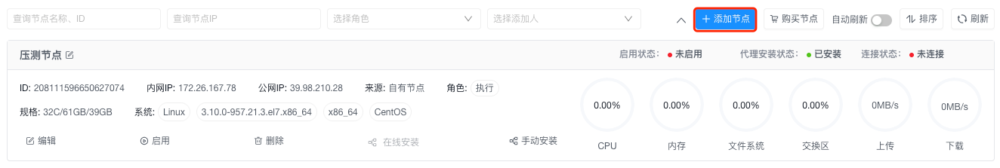
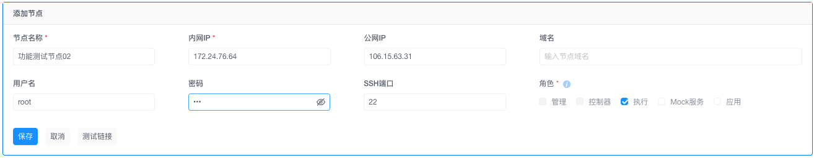
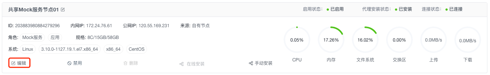
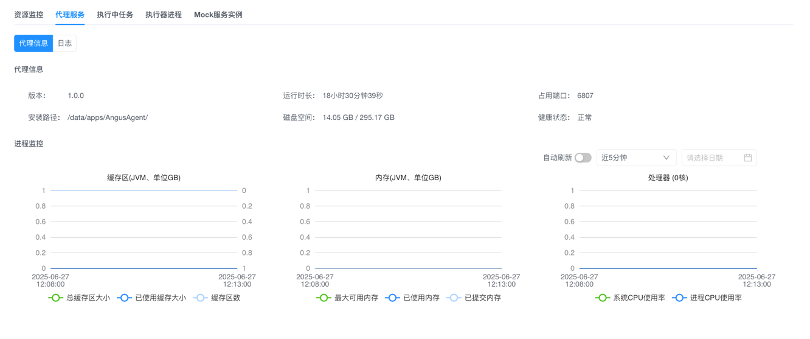
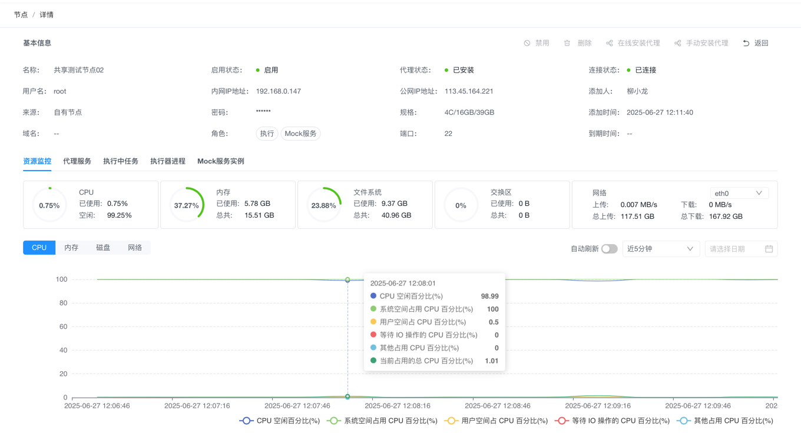
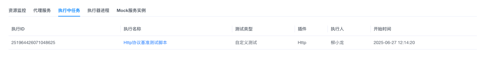
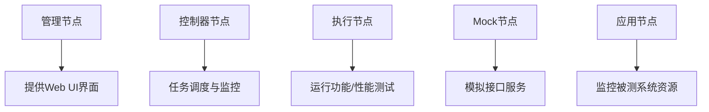

# 节点配置

> 通过节点配置实现测试任务的高效分发与资源调度，支持多角色节点管理。

## 一、基础准备
1. **系统要求**
   - 管理/控制节点：仅支持Linux系统
   - 执行节点：支持Linux/Windows/macOS  
     ⚠️ Windows节点需手动开放22端口

2. **权限验证**  
   ☑️ 当前账号需具备「系统管理员」角色

## 二、核心操作

### 1. 添加节点
1. `配置中心 → 节点管理` 点击「添加节点」  
   
2. **填写节点信息**：  
   ① 节点名称（示例：性能节点-01）  
   ② IP地址（内网通信地址）  
   ③ 操作系统类型
3. **分配角色**：
   - ☑️ 执行节点（压力测试）
   - ☑️ 应用节点（资源监控）
   - ☑️ Mock节点（接口模拟）
4. 点击「保存」完成添加  
   

⚠️ **云服务版**：需先购买节点配额  
⚠️ **社区版**：默认支持1个节点（[查看配额](../../introduction/quotas)）

### 2. 编辑节点
1. 节点列表 → 目标节点点击「编辑」图标  
   
2. 修改名称/IP/角色
3. 点击「保存」应用更改

### 3. 节点状态管理
1. **禁用节点**：
   - 点击「禁用」按钮 → 节点状态变为「未启用」
   - 将暂停任务调度，保留配置
2. **启用节点**：
   - 点击「启动」按钮 → 恢复「可用」状态

### 4. 代理安装
1. 按[安装指南](../../installation/AngusAgent)操作
2. 状态检查：
   - 节点详情页 →「代理服务」Tab  
     

### 5. 节点监控
1. 点击节点名称进入详情页
2. **查看资源使用**：
   - CPU/内存/磁盘实时曲线  
     
3. **查看运行任务**：
   - 「执行中任务」Tab → 实时任务列表  
     


## 四、注意事项

1. 节点角色划分


| 角色类型 | 核心职责 | 部署要求 | 推荐数量 |  
|----------|----------|----------|----------|  
| **管理节点** | 运行Web应用界面 | Linux系统 | 1台 |  
| **控制器节点** | 任务调度/节点监控 | Linux系统（独占） | ≥2台（HA） |  
| **执行节点** | 执行功能/性能测试 | 不限系统 | ≥3台 |  
| **Mock节点** | 模拟接口服务 | 网络隔离环境 | 按业务隔离需求 |  
| **应用节点** | 监控被测系统资源 | 部署在被测主机 | 按被测集群规模 |  

2. **角色分配原则**：  
   | 角色 | 建议数量 | 部署要求 |  
   |---|---|---|  
   | 控制节点 | ≥2台 | Linux系统 |  
   | 执行节点 | ≥3台 | 无限制 |  
   | Mock节点 | 按需 | 隔离网络 |

3. **网络环境选择**：
   ```mermaid
   graph LR
       A[压测目标] --> B{网络类型}
       B -->|极限性能| C[内网节点]
       B -->|真实模拟| D[公网节点]
   ```

