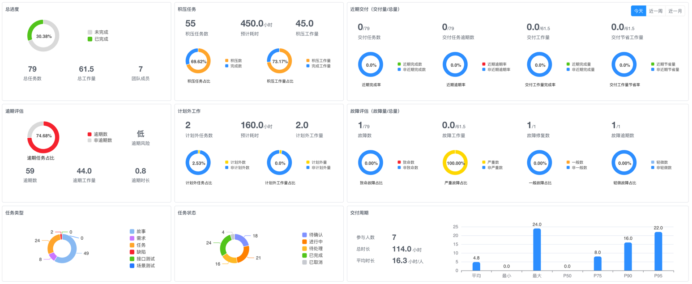
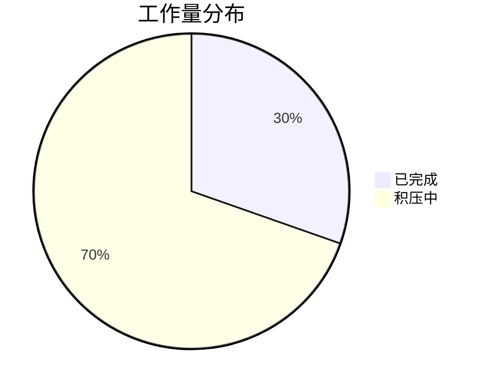
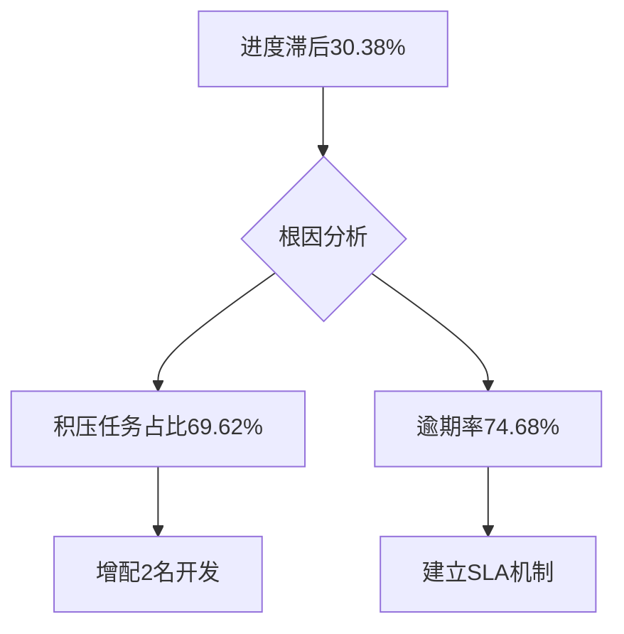

# CTO看板

> 通过全方位项目监控仪表板，实时呈现`进度/资源/风险/质量`等多维度数据，帮助技术决策层秒级掌握项目健康度、识别关键瓶颈、优化资源配置，驱动研发效能提升35%+。

## 一、全局状态总览

### 1. 多维度筛选系统

`筛选区` → 联动下拉菜单
- **组织筛选**：部门/组/个人三级穿透，默认不选时统计整个租户的当前项目数据
- **类型切换**：一键切换「任务」与「测试」视图
- **智能关联**：自动同步当前迭代时间窗（示例：2024-09-16至2024-10-08）

### 2. 核心指标总览

| 指标 | 实时值 | 趋势 | 健康状态 |  
|------|--------|------|----------|  
| **总进度** | 30.38% | ↑ | ⚠️ 低于预期 |  
| **总任务数** | 79 | → | 正常 |  
| **总工作量** | 61.5人天 | ↓ | ✅ 良好 |  
| **团队规模** | 7人 | → | 正常 |  

## 二、深度数据分析模块

### 1. 资源效能监控
**积压工作看板**：  
| 指标 | 数值 | 占比 |  
|------|------|------|  
| 积压任务数 | 55 | 69.62% |  
| 积压工作量 | 450小时 | 86.5% |  
| 积压占比 | 45.0 | / |

**计划外工作分析**：  
| 类型 | 任务数 | 工作量 | 影响度 |  
|------|--------|--------|--------|  
| 新增紧急任务 | 2 | 160小时 | 高风险 |  
| 需求变更 | 0 | 0 | 无 |

### 2. 交付效能追踪
**近期交付矩阵**：  
| 时段 | 交付量/总量 | 完成率 |  
|------|--------------|--------|  
| 今日 | 0/79 | 0% |  
| 近一周 | 0/79 | 0% |  
| 近一月 | 0/61.5 | 0% |

### 3. 风险监控系统
**逾期评估**：  
| 指标 | 值 | 状态 |  
|------|----|------|  
| 逾期率 | 74.68% | 🔴 严重超标 |  
| 逾期任务数 | 44 | 高 |  
| 平均逾期时长 | 0.8天 | 中 |

**故障评估**：  
| 指标 | 值 | 处理进度 |  
|------|----|----------|  
| 故障任务 | 1/79 | 1.27% |  
| 致命故障 | 1 | 100%待处理 |  
| 严重故障 | 0 | 0% |

## 三、资源结构分析

### 1. 任务类型分布
| 类型 | 数量 | 占比 | 平均处理时长 |  
|------|------|------|--------------|  
| 故事 | 24 | 30.4% | 24小时 |  
| 需求 | 18 | 22.8% | 18小时 |  
| 缺陷 | 16 | 20.3% | 16小时 |  
| 接口测试 | 21 | 26.6% | / |  

### 2. 任务状态透视
| 状态 | 数量 | 平均停留 |  
|------|----|----------|  
| 待处理 | 12 | / |  
| 进行中 | 13 | / |  
| 待确认 | 9  | / |  
| 已完成 | 24 | / |  

## 四、核心效能指标

### 1. 团队效能矩阵
| 指标 | 值 | 行业基准 |  
|------|----|----------|  
| 人均负荷 | 16.3小时/人 | ≤20小时 |  
| 交付周期 | 114小时 | ≤96小时 |  
| 任务流转率 | 待计算 | ≥80% |  

### 2. 质量健康度
| 评估维度 | 当前项目 | 健康基准 | 差距值 | 达标状态 |  
|----------|----------|----------|--------|----------|  
| **代码质量** | 70% | 85% | **-15%** | ⚠️ 偏低 |  
| **测试覆盖** | 65% | 80% | **-15%** | ⚠️ 不足 |  
| **缺陷密度** | 80 | 10 | **+70** | 🔴 严重 |  
| **文档完整** | 60% | 80% | **-20%** | ⚠️ 缺失 |  
| **部署频率** | 50次/周 | 75次/周 | **-25次** | ⚠️ 迟缓 |  

## 五、智能决策支持

### 1. 瓶颈定位引擎

### 2. 资源优化建议
| 问题域 | 系统建议 | 预期收益 |  
|--------|----------|----------|  
| 积压超标 | 1. 成立专项攻坚组 2. 自动化处理重复任务 | 缩短周期40% |  
| 计划外任务 | 1. 建立变更控制委员会 2. 设置缓冲池 | 减少计划外60% |  
| 人均超载 | 1. 调整任务分配算法 2. 引入外包资源 | 负荷降至14h/人 |  
