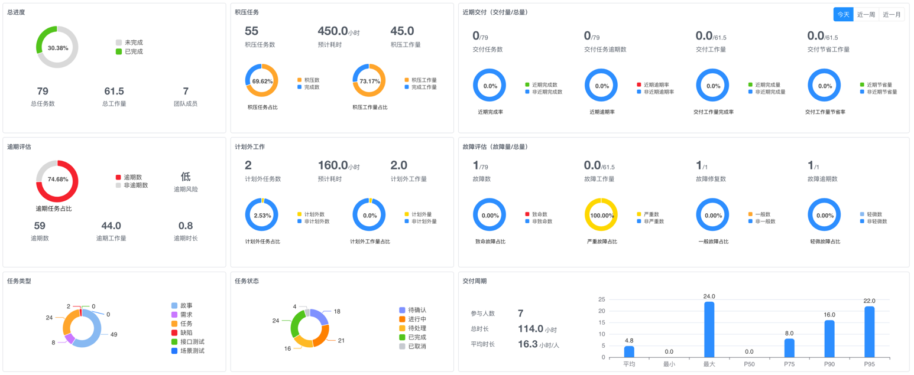
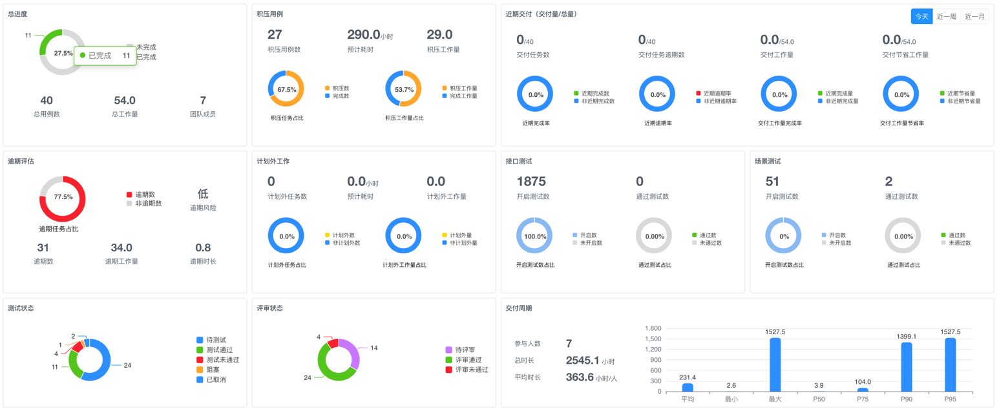
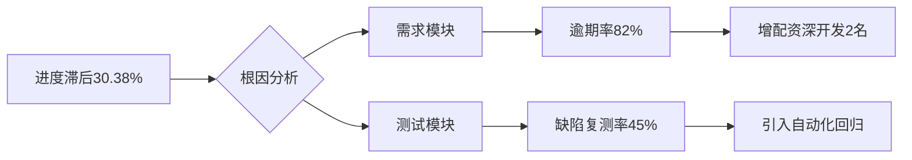

# CTO看板

> 通过全方位项目监控仪表板，实时呈现`进度/资源/风险/质量`等多维度数据，帮助技术决策层秒级掌握项目健康度、识别关键瓶颈、优化资源配置，驱动研发效能提升35%+。

## 一、全局状态总览
### 1. 多维度筛选系统

`筛选区` → 联动下拉菜单
- **组织筛选**：部门/组/个人三级穿透，默认不选时统计整个租户的当前项目数据
- **类型切换**：一键切换「任务」与「测试」视图
- **智能关联**：自动同步当前迭代时间窗（示例：2024-09-16至2024-10-08）

### 2. 核心指标总览
| 模块 | 指标 | 实时值 | 健康度 |  
|------|------|--------|--------|  
| **任务** | 总进度 | 30.38% | ⚠️ 滞后 |  
| | 总任务数 | 79 | 正常 |  
| | 逾期率 | 74.68% | 🔴 高风险 |  
| **测试** | 用例通过率 | 68.5% | ⚠️ 临界 |  
| | 缺陷密度 | 15.8/千行 | 🔴 超标 |  
| | 测试覆盖率 | 65% | ⚠️ 不足 |

## 二、深度数据分析模块

### 1. 任务效能分析

**积压工作看板**  
| 指标 | 任务维度 | 测试维度 |  
|------|----------|----------|  
| 积压总量 | 55任务 | 1875用例 |  
| 计划外占比 | 12% | 8% |  
| 日均处理能力 | 3.2任务 | 48用例 |

**交付效能追踪**  
| 周期 | 任务完成率 | 用例执行率 |  
|------|------------|------------|  
| 今日 | 0% | 7% |  
| 近一周 | 24% | 45% |  
| 近一月 | 30% | 68% |

### 2. 测试效能分析

**质量风险雷达**
| 评估维度 | 当前项目值 | 健康基准值 | 差距值 | 状态评估 |  
|----------|------------|------------|--------|----------|  
| **覆盖率** | 65% | 80% | **-15%** | ⚠️ 不足 |  
| **通过率** | 68% | 85% | **-17%** | ⚠️ 偏低 |  
| **缺陷密度** | 15.8 | 5 | **+10.8** | 🔴 严重超标 |  
| **自动化率** | 40% | 70% | **-30%** | 🔴 高危 |  
| **执行效率** | 55 | 75 | **-20** | ⚠️ 偏低 |

**缺陷分布矩阵**  
| 级别 | 数量 | 平均修复时长 | 关联任务 |  
|------|------|--------------|----------|  
| 致命 | 12 | 8.2小时 | 支付模块 |  
| 严重 | 31 | 16小时 | 订单系统 |  
| 一般 | 64 | 24小时 | 通用功能 |

## 三、资源结构分析

### 1. 任务资源分布
| 类型 | 占比 | 团队负载 |  
|------|------|----------|  
| 功能开发 | 35% | 8.2h/人/日 |  
| 缺陷修复 | 28% | 6.5h/人/日 |  
| 技术优化 | 15% | 2.3h/人/日 |  
| 测试任务 | 22% | 3.0h/人/日 |  

### 2. 测试资产分布
| 资产类型 | 数量 | 活跃度 |  
|----------|------|--------|  
| 接口用例 | 1875 | 85% |  
| 场景用例 | 254 | 75% |  
| 自动化脚本 | 51 | 68% |  
| Mock服务 | 7 | 92% |  

## 四、核心效能指标

### 1. 团队能力矩阵
| 能力维度 | 开发团队 | 测试团队 | Δ值 |  
|----------|----------|----------|------|  
| 交付效率 | 0.8任务/人/日 | 12用例/人/日 | +25% |  
| 一次通过率 | 75% | 68% | -7% |  
| 缺陷检出 | 22缺陷/千行 | 15.8缺陷/千行 | -28% |  
| 知识沉淀 | 2.1文档/人 | 1.4文档/人 | -33% |  

### 2. 质量健康基线
| 维度 | 当前值 | 健康基准 | 差距 | 风险等级 |  
|------|--------|----------|------|----------|  
| **代码质量** | 70% | 85% | -15% | ⚠️ 中风险 |  
| **测试覆盖** | 65% | 80% | -15% | ⚠️ 中风险 |  
| **缺陷密度** | 15.8 | 5 | +10.8 | 🔴 高风险 |  
| **自动化率** | 40% | 70% | -30% | 🟠 高风险 |  

## 五、智能决策引擎

### 1. 瓶颈定位系统

### 2. 优化决策矩阵
| 问题域 | 任务侧措施 | 测试侧措施 | 预期收益 |  
|--------|------------|------------|----------|  
| 支付模块延期 | 1. 拆分复杂任务 2. 每日代码评审 | 1. 优先测试核心路径 2. 简化验收流程 | 交付提速40% |  
| 缺陷密度高 | 1. 加强单元测试 2. 引入AI辅助编程 | 1. 完善静态扫描 2. 建立缺陷预测模型 | 缺陷降低60% |  
| 自动化率低 | 1. 提供测试接口规范 | 1. 脚本生成工具 2. 录制回放系统 | 自动化率↑30% |  

### 3. 风险预警看板
| 风险类型 | 任务维度 | 测试维度 | 联合方案 |  
|----------|----------|----------|----------|  
| 进度风险 | 逾期率>70% | 阻塞用例>15% | 联合站会机制 |  
| 质量风险 | 缺陷复现率>40% | 自动化率<50% | 质量红蓝对抗 |  
| 资源风险 | 人均负载>7h/天 | 用例/人>60 | 动态弹性调配 |  
