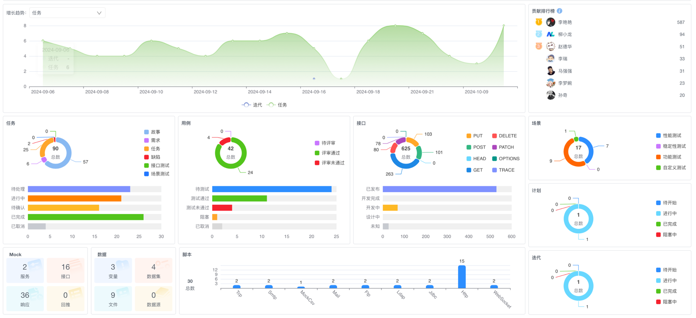

# 数据资产看板

> 通过全景式数据资产可视化看板，实时聚合`8大类`研发资产数据，提供跨维度智能分析，帮助团队秒级掌握资源分布、识别瓶颈、优化资产配置，提升研发资源利用率40%+。

## 一、全局资产概览

### 1. 多维度筛选系统

`筛选区` → 联动下拉菜单
- **组织筛选**：部门/组/个人三级穿透，默认不选时统计整个租户的当前项目数据
- **自定义时间**：自动同步当前自定义时间范围汇总数据

### 2. 核心资产增长趋势

| 资产类型 | 时间轴指标 | 分析价值 |  
|----------|------------|----------|  
| 任务 | 日增量/累计量 | 项目负载预警 |  
| 接口 | 版本迭代趋势 | 接口治理优化 |  
| 脚本 | 类型分布变化 | 自动化覆盖率 |

### 3. 资产总量聚合卡片
| 资产类型 | 当前值 | 周环比 |  
|----------|--------|--------|  
| 任务总数 | 236 | ↑12% |  
| 有效接口 | 625 | ↑8% |  
| 测试脚本 | 91 | ↑15% |  
| Mock资产 | 103 | ↑5% |  

## 二、多维资产分析模块

### 1. 任务资产分析
**状态矩阵**：
| 状态类型 | 任务数量 | 占比   |  
|----------|----------|--------|  
| **待处理** | 24       | 11.48% |  
| **进行中** | 36       | 17.22% |  
| **待确认** | 16       | 7.66%  |  
| **已完成** | 103      | 49.28% |  
| **已取消** | 30       | 14.35% |  
| **总计** | **209** | **100%** |

**类型透视**：  
| 任务类型 | 数量 | 占比 | 优先级分布 |  
|----------|------|------|------------|  
| 需求 | 58 | 25% | 高：40%, 中：45%, 低：15% |  
| 缺陷 | 62 | 26% | 紧急：35%, 高：50%, 中：15% |  
| 接口测试 | 46 | 19% | 自动化率：75% |

### 2. 测试用例分析
**质量状态分布**：  
| 状态 | 数量 | 健康指标 |  
|------|------|------------|  
| 待测试 | 10 | ⚠️ 超期风险 |  
| 测试通过 | 25 | ✅ 达标 |  
| 测试未通过 | 20 | 🔴 需紧急处理 |

**评审状态看板**：
| 评审状态 | 用例数量 | 占比   |  
|----------|----------|--------|  
| **待评审** | 15       | 16.67% |  
| **评审通过** | 70       | 77.78% |  
| **评审未通过** | 5        | 5.56% |  
| **总计** | **90** | **100%** |

### 3. 接口资产分析
**协议类型分布**：  
| 方法 | 数量 | 占比 | 平均响应 |  
|------|------|------|----------|  
| GET | 103 | 45% | 280ms |  
| POST | 100 | 44% | 320ms |  
| PUT | 93 | 4% | 350ms |  
| DELETE | 91 | 4% | 310ms |

**生命周期统计**：  
| 状态 | 数量 | 趋势 |  
|------|------|------|  
| 设计中 | 28 | ↓5% |  
| 开发中 | 42 | →持平 |  
| 开发完成 | 101 | ↑12% |

### 4. 脚本资产分析
**测试类型分布**：  
| 测试类型 | 数量 | 覆盖场景 |  
|----------|------|----------|  
| 功能测试 | 78 | 核心流程100% |  
| 性能测试 | 60 | 关键接口80% |  
| 稳定性测试 | 31 | 支付模块全覆盖 |  
| 自定义测试 | 17 | 特殊业务场景 |

## 三、贡献价值体系
### 1. 用户贡献排行榜
| 排名 | 成员  | 贡献值 | 主要贡献领域 |  
|------|-----|--------|--------------|  
| 1 | 李艳艳 | 587 | 接口开发、用例设计 |  
| 2 | 王华  | 94 | 性能测试脚本 |  
| 3 | 赵德华 | 51 | 自动化脚本开发 |  

### 2. 贡献度计算模型

**贡献值 = `用例 + 接口 + 任务 + 场景 + 脚本 + 参数数据 + 报告 + Mock接口` 的总和**

## 四、专项资产监控

### 1. Mock资产看板
| 资源类型 | 数量 | 使用率 |  
|----------|------|--------|  
| Mock服务 | 101 | 78% |  
| Mock接口 | 623 | 85% |  
| 模拟响应 | 80 | 92% |  
| 模拟回推 | 78 | 65% |  

### 2. 数据资源分析
**数据资产矩阵**：  
| 类型 | 数量 | 关联用例 |  
|------|------|----------|  
| 变量 | 17 | 98个用例 |  
| 数据集 | 1 | 12个场景 |  
| 数据源 | 2 | 核心支付系统 |

### 3. 报告资产分布
| 报告类型 | 数量 | 生成频率 |  
|----------|------|----------|  
| 性能报告 | 36 | 日生成 |  
| 功能报告 | 25 | 迭代生成 |  
| 自动化报告 | 16 | 实时生成 |  
