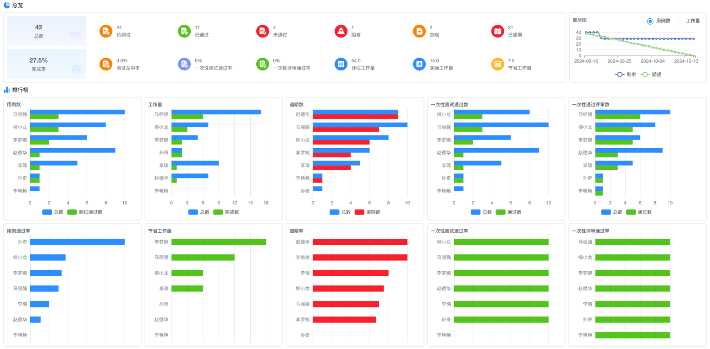

# 效能分析看板

> 通过双维度`研发任务+功能测试`实时效能看板，精准呈 ***30+*** 项关键指标与可视化分析，帮助团队秒级掌握项目进展、识别瓶颈、优化资源配置，驱动研发测试效能提升 ***40%***。

## 一、整体架构概览
### 1. 多维度筛选系统

`筛选区` → 联动下拉菜单
- **组织筛选**：部门/组/个人三级穿透，默认不选时统计整个租户的当前项目数据
- **类型切换**：一键切换「任务」与「测试」视图
- **智能关联**：自动同步当前迭代时间窗（示例：2024-09-16至2024-10-08）

### 2. 核心指标总览
| 指标 | 实时值 | 健康阈值 | 分析价值 |  
|------|--------|----------|----------|  
| **任务总数** | 83 | / | 整体工作规模 |  
| **完成率** | 30.38% | ≥70% | 进度滞后预警（红色） |  
| **一次性通过率** | 100% | ≥85% | 质量达标信号 |  
| **逾期数** | 59 | ≤5 | 流程阻塞警报 |  
| **节省工作量** | 29.0 | / | 效能提升量化 |  

## 二、研发任务效能模块

### 1. 多维指标矩阵
**任务生命周期监测**：

| 状态分类 | 任务数 | 说明                     |
|----------|--------|--------------------------|
| 待处理   | 18     | 尚未开始处理的任务       |
| 待执行   | 21     | 已分配但未执行的任务     |
| 已取消   | 16     | 已取消的无效任务         |
| 已完成   | 28     | 成功完成的任务           |

**深度效能分析**：  
| 指标类别 | 关键指标 | 看板体现 |  
|----------|----------|----------|  
| **进度监控** | 完成率30.38% | 环形图+趋势线 |  
| **质量评估** | 一次性通过率100% | 绿色高亮显示 |  
| **资源效率** | 节省工作量29.0 | 同比箭头↑ |  
| **风险管理** | 逾期数59 | 红色警报标识 |

### 2. 智能分析工具
**任务燃尽图**：
  | 日期       | 实际剩余任务量 | 预期剩余任务量 | 差值（实际-预期） | 进度状态 |  
  |------------|----------------|----------------|------------------|----------|  
  | **2024-09-16** | 49             | 49             | 0                | 符合预期 |  
  | **2024-09-20** | 20             | 35             | **-15**          | **提前完成** |  
  | **2024-09-25** | 18             | 20             | -2               | 略微超前 |  
  | **2024-09-27** | 16             | 10             | **+6**           | **进度滞后** |  
  | **2024-10-08** | 0              | 0              | 0                | 准时完成 |  

**洞察逻辑**：
- 实际线持续高于预期 → 资源短缺预警
- 末期陡降 → 存在突击赶工风险

### 3. 效能排行榜
**三维人才评估模型**：
| 排名 | 成员姓名 | 任务总数 | 效率评级 | 任务占比 |  
|------|----------|----------|----------|----------|  
| **1** | 李瑞     | 18       | ⭐⭐⭐⭐⭐ | 21.69%   |  
| **2** | 王晟   | 15       | ⭐⭐⭐⭐   | 18.07%   |  
| **3** | 李艳婉   | 12       | ⭐⭐⭐⭐   | 14.46%   |  
| **4** | 李四     | 9        | ⭐⭐⭐     | 10.84%   |  
| **5** | 赵德华   | 7        | ⭐⭐⭐     | 8.43%    |  

**分析维度**：
1. 任务总数榜：识别高负载成员
2. 完成数榜：发掘高效执行者
3. 工作量榜：量化价值产出

## 三、功能测试效能模块

### 1. 全链路监控指标
**用例状态追踪**：  
| 状态 | 数量 | 占比 |  
|------|------|------|  
| 待测试 | 24 | 28.9% |  
| 已取消 | 24 | 28.9% |  
| 已完成 | 24 | 28.9% |

**深度质量分析**：  
| 指标 | 计算逻辑 | 优化方向 |  
|------|----------|----------|  
| **逾期率** | 逾期数/总数 | >15%需流程再造 |  
| **一次性通过率** | 首测通过数/有效用例 | <80%暴露用例设计缺陷 |  
| **阻塞率** | 阻塞用例数/总数 | >10%提示环境问题 |

### 2. 测试燃尽分析
| 日期       | 剩余用例数 | 目标用例数 | 差值（实际-目标） | 状态评估 |  
|------------|------------|------------|------------------|----------|  
| **2024-09-16** | 83         | 83         | 0                | 计划起点 |  
| **2024-09-20** | 60         | 50         | **+10**          | **严重滞后** |  
| **2024-09-25** | 40         | 25         | **+15**          | **显著滞后** |  
| **2024-10-08** | 0          | 0          | 0                | 准时完成 |  

**诊断信号**：
- 中期滞后 >15% → 需增加测试资源
- 末期未归零 → 交付延期风险

### 3. 测试效能榜单
**人才能力画像**：
| 排名 | 成员姓名 | 完成用例数 | 效能评级 | 团队贡献占比 |  
|------|----------|------------|----------|--------------|  
| **1** | 李瑞     | 18         | ⭐⭐⭐⭐⭐ | 40.0%        |  
| **2** | 李艳婉   | 15         | ⭐⭐⭐⭐   | 33.3%        |  
| **3** | 王凯   | 12         | ⭐⭐⭐⭐   | 26.7%        |  

**核心维度**：
1. 缺陷发现榜：质量守护者
2. 用例通过榜：高效执行者
3. 工作量节省榜：流程优化者

## 四、决策支持场景

### 1. 晨会同步

### 2. 迭代复盘
| 问题类型 | 看板证据 | 改进动作 |  
|----------|----------|----------|  
| 需求蔓延 | 燃尽线中期陡升 | 强化需求冻结机制 |  
| 测试延迟 | 用例完成率滞后 | 引入分层自动化 |  
| 资源错配 | 成员负载差异>50% | 动态均衡分配 |  

### 3. 绩效评估
**三维评估模型**：

