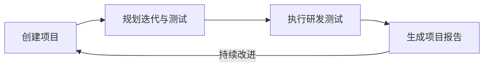

# 项目流程

> `AngusTester项目流程`提供端到端的研发测试管理方案，覆盖从项目创建到成果报告的全生命周期，助力团队实现高效协作与质量保障。

## 流程闭环机制

**关键控制点**：
1. **每日站会**：同步进度/识别阻塞
2. **迭代评审**：演示成果/收集反馈
3. **质量门禁**：代码审查/测试覆盖率检查
4. **里程碑审计**：阶段成果验收

## 完整项目流程

### 一、创建项目

#### 功能概述
建立项目基础框架，设定管理边界与资源配置，为后续流程提供结构化支撑。

#### 操作步骤
1. **导航入口**  
   登录后进入 `项目 → 添加项目`

2. **创建项目**
    - 点击「添加项目」按钮
    - 选择项目模板（敏捷/通用/测试）
    - 填写必填项：`项目名称、添加负责人、时间、项目成员`
    - 输入项目描述（2000字内）

3. **基础配置**
    - 定义软件功能模块，方便组织和分解各类任务
    - 设置项目数据分类标签（如：Web产品/移动端）
    - 规划目标软件版本（如：1.0.0、2.0.0）

> ⚠️ **关键配置**：
> - 项目名称需保持唯一性
> - 初始项目时必须指定项目负责人，促进项目的完成和进度控制，如：解决问题、推进进度、协作团队成员等。

### 二、规划迭代与测试

#### 功能概述
制定可执行的工作计划，明确任务分工与验收标准，建立可量化的目标体系。

#### 操作步骤
1. **创建迭代计划**
    - 进入项目详情页
    - 点击「添加迭代」
    - 设置迭代周期（建议2-4周）
    - 定义迭代目标（SMART原则）

2. **制定测试计划**
    - 在测试模块点击「新建测试计划」
    - 配置：
        - 测试范围（功能模块）
        - 测试类型（功能/性能/安全）
        - 准入/准出标准
        - 风险评估矩阵

3. **任务分解**
    - 使用工作分解结构（按功能模块树分解和组织）工具
    - 创建主任务 → 拆分子任务
    - 设置任务依赖关系
    - 分配负责人与截止时间

> ⚠️ **最佳实践**：
> - 每个任务工作量控制在3人日内
> - 关键路径任务设置缓冲时间

### 三、执行研发测试活动

#### 功能概述
实施计划任务，实时跟踪进度与质量，确保交付物符合验收标准。

#### 核心操作
1. **任务执行**
    - 开发人员：在「我的任务」查看待办事项
    - 测试人员：执行分配的测试用例
    - 每日更新任务状态（进行中/阻塞/完成）

2. **缺陷管理**
    - 发现缺陷点击「新建缺陷」
    - 填写：
        - 重现步骤
        - 严重等级（致命/严重/一般/建议）
        - 影响模块
    - 指派修复负责人

3. **需求管控**
    - 需求变更发起「变更请求」
    - 评估影响范围（任务/进度/资源）
    - CCB（变更控制委员会）审批

4. **测试执行**
    - 按测试计划执行用例
    - 记录测试结果（通过/失败/阻塞）
    - 失败用例关联缺陷单

> ⚠️ **质量红线**：
> - 致命缺陷必须清零才能发布
> - 每日构建需通过冒烟测试

### 四、生成项目报告

#### 功能概述
汇总项目成果数据，进行效能分析与知识沉淀，支撑持续改进决策。

#### 操作流程
1. **进度报告**
    - 进入「报表中心」
    - 选择「项目进度」报表类型
    - 查看：
        - 里程碑达成率
        - 任务完成趋势
        - 关键路径状态

2. **质量分析**
    - 生成「质量报告」
    - 关键指标：
        - 缺陷密度（缺陷数/千行代码）
        - 缺陷解决周期
        - 测试覆盖率

3. **效能评估**
    - 导出「团队效能」报表
    - 分析：
        - 需求吞吐量
        - 资源利用率
        - 计划偏差率

4. **知识沉淀**
    - 归档项目文档：
        - 需求规格说明书
        - 测试用例库
        - 缺陷分析报告
    - 创建经验教训库

> ⚠️ **报告要求**：
> - 项目结束3日内完成终版报告
> - 关键指标需与基准值对比分析

