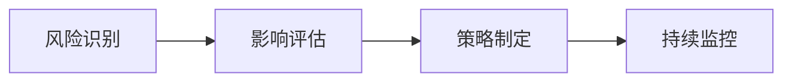

# 项目介绍

> `AngusTester项目`为团队提供集中化工作管理平台，实现资源整合、进度跟踪与风险管控的一体化解决方案，全面提升项目交付效率与质量。

## 核心价值

### 1. 结构化工作管理
**功能**：分层组织项目资源  
**实现方式**：
- 将项目按模块分解为阶段/子任务
- 建立任务依赖关系
- 可视化工作负载分配

**价值点**：
> 明确任务分工，确保各阶段按时交付

### 高效团队协作
**功能**：创建集中化协作空间  
**核心能力**：
- 实时沟通工具集成
- 文档共享中心
- 统一任务看板

**价值点**：
> 消除信息孤岛，减少沟通成本

### 2. 智能进度跟踪
**功能**：实时监控项目健康度  
**关键特性**：
- 任务状态实时看板
- 自动瓶颈预警
- 多维度效能分析报表

**价值点**：
> 数据驱动决策，及时调整项目方向

### 3. 全面风险管理
**功能**：前瞻性风险管控  
**工作流**：
1. 风险识别
2. 影响评估
3. 应对策略制定
4. 持续跟踪

**价值点**：
> 降低项目失败率，保障交付质量

## 核心功能

### 1. 工作分解与执行
**功能**：层级化任务管理  
**操作路径**：
1. 创建项目
2. 添加主任务
3. 分解子任务（如果需要时）
4. 设置任务 `经办人、优先级、依赖`等
5. 经办人执行任务

### 2. 实时协作空间（TODO）
**功能**：一体化协作环境  
**包含模块**：
- 文档知识库
- 任务讨论区
- 文件共享中心
- 变更通知系统

**操作提示**：
> 使用@mention功能快速关联成员

### 3. 智能报表系统
**报表类型**：
1. **资源利用率**：团队工作量分布
2. **进度跟踪**：里程碑达成率
3. **质量分析**：缺陷分布趋势
4. **风险热图**：高优先级风险项

**生成方式**：
1. 选择报表类型
2. 设置时间范围
3. 自定义筛选条件
4. 导出/分享报表

### 4. 风险管控工作流（TODO）
**四步管理法**：

**关键操作**：
- 设置风险等级（高/中/低）
- 指定风险负责人
- 添加应对措施
- 设置自动提醒

## 项目模板

### 1. 敏捷项目模板
**核心特点**：  
专为敏捷开发团队设计的模板，支持Scrum框架完整工作流，提供迭代增量交付能力，确保产品开发始终围绕用户需求展开。通过看板视图和冲刺规划工具，实现需求到交付的全流程跟踪。

**适用场景**：
- 采用敏捷开发模式的软件团队
- 需要快速迭代的产品项目
- 用户需求频繁变更的场景
- 跨职能协作的敏捷小组

**典型工作流**：
1. 需求拆解为用户故事
2. 规划迭代周期（通常2-4周）
3. 每日站会同步进展
4. 迭代结束进行评审回顾
5. 持续交付可用产品增量

### 2. 通用项目模板
**核心特点**：  
提供标准化项目管理框架，支持工作分解结构（按模块分解）构建，集成甘特图进度管理工具，可视化展示任务依赖关系。通过资源负荷视图，实现跨团队协作的精细化管理。

**适用场景**：
- 传统瀑布式开发项目
- 跨部门协作的复杂工程
- 研发周期较长的产品
- 需要严格进度控制的场景

**核心组件**：
- **工作分解结构**：层级化分解项目任务
- **甘特图**：可视化展示时间线与依赖
- **里程碑跟踪**：关键节点进度监控
- **资源管理**：团队工作量均衡分配

### 3. 测试项目模板
**核心特点**：  
专为质量保障团队设计的全流程测试管理方案，支持从测试计划制定到缺陷闭环的完整生命周期管理。集成功能测试、接口测试、性能测试等多维度测试能力，提供缺陷跟踪看板。

**适用场景**：
- 软件质量保障团队
- 专项测试项目（如安全测试）
- 持续集成/持续交付（CI/CD）流程
- 产品发布前的质量验证

**关键能力**：
1. **测试计划定制**：定义测试范围与策略
2. **用例管理**：设计并执行测试场景
3. **缺陷跟踪**：从发现到修复的闭环管理
4. **质量报告**：自动生成测试覆盖率分析

> ⚠️ **注意事项**：项目模版类型不允许二次修改。

## 项目信息

| 参数                 | 字段名              | 类型         | 必填     | 长度限制 | 说明                                                             |
|----------------------|--------------------|--------------|--------|----------|----------------------------------------------------------------|
| **ID**           | id                 | `long`       | **条件** | /        | 唯一标识符； 系统自动生成； 修改时必须                                                |
| 项目类型         | type               | `enum`       | 否      | /        | 项目类型枚举： - `AGILE`(敏捷、默认),  - `GENERAL`(一般),  - `TESTING`(测试) |
| **项目名称**         | name               | `string`     | **是**  | ≤100     | 项目唯一标识名称                                                       |
| 项目图标             | avatar             | `string`     | 否      | ≤400     | 项目视觉标识                                                         |
| **负责人ID**         | ownerId            | `long`       | **是**  | /        | 项目主要负责人                                                        |
| 负责人姓名           | ownerName          | `string`     | 否      | /        | 负责人姓名                                                          |
| **开始日期**         | startDate          | `datetime`   | **是**  | /        | 项目启动时间                                                         |
| **截止日期**         | deadlineDate       | `datetime`   | **是**  | /        | 项目计划完成时间                                                       |
| 项目描述             | description        | `string`     | 否      | ≤2000    | 项目目标与范围说明                                                      |
| 导入示例数据         | importExample      | `boolean`    | 否      | /        | 是否导入演示数据 默认`false`                                         |
| **成员配置**         | memberTypeIds      | `map`        | **是**  | /        | 成员类型与ID映射 格式：`{OrgTargetType: [ID1,ID2]}`                  |
| 项目成员             | members            | `map`        | 否      | /        | 成员详细信息 创建后自动生成                                             |
| 创建人ID             | createdBy          | `long`       | 只读      | /        | 项目创建人ID                                                        |
| 创建人姓名           | createdByName      | `string`     | 只读      | /        | 创建人姓名                                                          |
| 创建时间             | createdDate        | `datetime`   | 只读      | /        | 项目创建时间                                                         |
| 最后修改人ID         | lastModifiedBy     | `long`       | 只读      | /        | 最后修改人ID                                                        |
| 最后修改人姓名       | lastModifiedName   | `string`     | 只读      | /        | 最后修改人姓名                                                        |
| 最后修改时间         | lastModifiedDate   | `datetime`   | 只读     | /        | 最后修改时间                                                         |

### 项目类型枚举（ProjectType）

| 枚举值    | 中文说明       | 适用场景                     |
|-----------|----------------|------------------------------|
| `AGILE`   | 敏捷项目管理   | 快速迭代的软件开发项目       |
| `GENERAL` | 一般项目管理   | 传统瀑布式开发项目           |
| `TESTING` | 软件测试项目   | 专项质量保障项目             |

### 成员类型枚举（OrgTargetType）

| 枚举值    | 中文说明 | 说明                     |
|-----------|----------|--------------------------|
| `USER`    | 用户     | 添加具体用户成员         |
| `DEPT`    | 部门     | 添加整个部门成员         |
| `GROUP`   | 小组     | 添加特定小组成员         |
