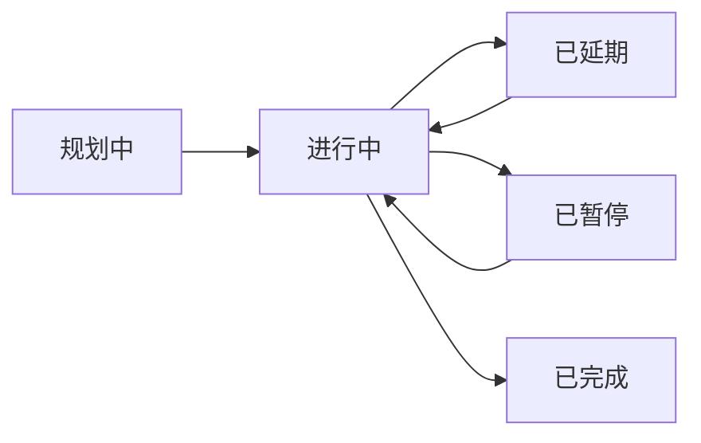

# 项目管理

> `AngusTester项目管理`功能提供全生命周期项目管控能力，支持从创建、配置到协作的全流程管理，确保项目高效交付。

## 项目核心操作

### 1. 创建项目
**功能**：建立新项目框架  
**步骤**：
1. 导航至 `项目 → 项目列表`
2. 点击「添加项目」按钮
3. 填写基础信息：
    - **模版**：选择模版类型（模版应用场景查看右侧提示）
    - **图标**：视觉标识（可选）
    - **名称**：唯一项目标识
    - **负责人**：项目主负责人
    - **项目成员**：明确项目的参与人员
    - **时间计划**：开始/结束日期
    - **描述**：项目目标说明（≤2000字）
4. 添加项目成员（至少1人）
5. 点击「保存」完成创建

> ⚠️ **关键要求**：
> - 项目名称需全局唯一
> - 成员必须包含负责人角色
> - 时间计划需符合实际周期

**配额规则**

不同版本的项目数量限制如下：
| 版本类型   | 默认配额    | 扩展方式                                              |
|------------|---------|---------------------------------------------------|
| 云服务版   | `2000个` | 提交[工单申请](https://wo.xcan.cloud/workorders/create) |
| 私有部署版 | `2000个` | 联系系统管理员调整可证                                 |

> 提示：实时配额可在[资源配额页面](../../introduction/quotas)查看`标签数`。

### 2. 编辑项目
**功能**：更新项目配置信息  
**步骤**：
1. 在项目列表中找到目标项目
2. 点击「编辑」按钮
3. 修改字段：
    - 基本信息（名称/描述/时间）
    - 成员变更（添加/移除成员）
    - 图标更新
4. 点击「保存」应用更改

> ⚠️ **注意事项**：
> - 关键信息变更需通知成员
> - 项目模版类型不允许二次修改

### 3. 删除项目
**功能**：移除不再需要的项目  
**步骤**：
1. 在项目列表中找到目标项目
2. 点击「删除」按钮
3. 确认删除操作（二次确认）
4. 系统移除此项目

> ⚠️ **数据保护**：
> - 删除前自动备份项目数据
> - 可在`项目 → 回收站`找回
> - 彻底删除需管理员或删除人权限

### 4. 查看项目详情
**功能**：查看项目完整信息  
**步骤**：
1. 在项目列表中找到目标项目
2. 点击项目名称
3. 查看详情页包含：
    - 基础信息卡片
    - 软件模块信息
    - 软件版本
    - 数据标签
    - 进度明细看板（TODO）

## 项目状态管理（TODO）

### 状态流转图

### 状态变更操作
**步骤**：
1. 在项目列表找到目标项目
2. 点击`更新状态`按钮
3. 选择新状态
4. 确认变更

> ⚠️ **状态规则**：
> - 仅只允许管理员、创建人和负责人可变更状态
> - "已完成"状态需满足：
    >   - 所有里程碑达成
>   - 无严重以上缺陷
>   - 文档归档完成

## 数据安全策略

### 权限矩阵
| 操作权限 | 管理员/负责人/创建人 | 项目成员 | 访客 |
| -------- |------| -------- | ---- |
| 创建项目 | ✓    | ✗        | ✗    |
| 编辑项目 | ✓    | ✗        | ✗    |
| 删除项目 | ✓    | ✗        | ✗    |
| 项目活动 | ✓    | ✓        | ✗    |

> ⚠️ **权限控制**：只允许管理员、创建人和负责人修改和删除项目。

### 审计追踪
**功能**：记录关键操作历史  
**包含记录**：
- 项目配置变更
- 项目内所有资源操作记录

**步骤**：  
1. 导航至 `项目 → 日志`
2. 筛选条件中`选择项目`过滤
3. 查看对应活动记录

