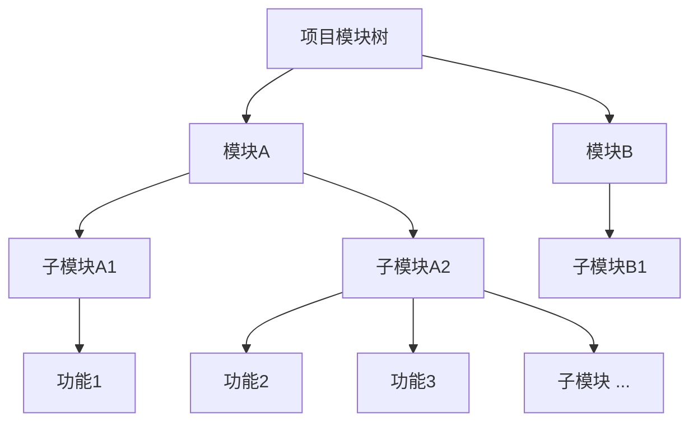

# 模块管理

> `AngusTester模块管理`提供层级化的功能组织能力，通过模块树实现需求、任务和用例的结构化管理，提升功能可维护性和团队协作效率。

## 模块树结构

## 模块核心操作

### 1. 添加模块
**功能**：创建新的功能模块作为根节点  
**步骤**：
1. 导航至 `项目 → 项目列表 → 编辑`
2. 进入编辑页面后切换到``
2. 点击「添加模块」按钮
3. 输入唯一模块名称（≤50字符）
4. 点击「确定」完成创建

> ⚠️ **命名规范**：
> - 避免使用特殊字符
> - 名称需反映功能领域

**配额规则**

不同版本的模块数量限制如下：
| 版本类型   | 默认配额    | 扩展方式                                              |
|------------|---------|---------------------------------------------------|
| 云服务版   | `5000个` | 提交[工单申请](https://wo.xcan.cloud/workorders/create) |
| 私有部署版 | `5000个` | 联系系统管理员调整可证                                 |

> 提示：实时配额可在[资源配额页面](../../introduction/quotas)查看`模块数`。

### 2. 添加子模块
**功能**：在现有模块下创建子节点  
**步骤**：
1. 在目标父模块上右键
2. 选择「新建子模块」
3. 输入子模块名称
4. 点击「确定」保存

**层级规则**：
- 最多支持5级嵌套
- 同级模块名称需唯一

### 3. 编辑模块
**功能**：更新模块名称信息  
**步骤**：
1. 定位目标模块
2. 右键点击「编辑」
3. 修改模块名称
4. 点击「保存」

> ⚠️ **影响范围**：  
> 修改后自动更新所有关联资源显示名称

### 4. 查看模块
**功能**：浏览完整模块树结构  
**步骤**：
1. 进入 `项目详情 → 模块Tab`
2. 查看树形结构：
   - 展开/折叠层级
   - 查看模块关联资源数

### 5. 调整模块顺序
**功能**：优化模块展示优先级  
**操作选项**：
- **上移**：提升模块展示位置
- **下移**：降低模块展示位置

**步骤**：
1. 选中目标模块
2. 右键选择「移到上一层」或「下移」
3. 系统自动刷新位置

> ⚠️ **层级限制**：  
> 仅支持同级模块顺序调整

### 6. 删除模块
**功能**：移除不再需要的模块节点  
**步骤**：
1. 右键目标模块选择「删除」
2. 确定删除操作（二次验证）
3. 系统移除模块节点

> ⚠️ **数据安全**：
> - 仅删除模块节点
> - 关联任务/用例不受影响
> - 管理员可在操作日志回溯

## 模块应用场景

### 1. 组织测试任务
**功能**：按模块分组管理任务  
**步骤**：
1. 创建/编辑任务时
2. 在「模块」字段选择目标模块
3. 查看时切换「按模块分组」视图

### 2. 管理测试用例
**功能**：结构化组织测试用例  
**最佳实践**：
- **顶层模块**：业务领域（如用户管理）
- **子模块**：功能点（如登录/注册）
- **叶子节点**：具体功能（如忘记密码）

**操作路径**：
1. 创建用例时指定模块
2. 使用模块树筛选用例
3. 导出模块专属用例集
